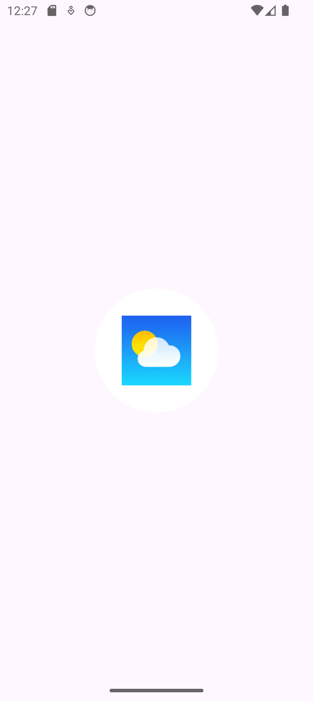
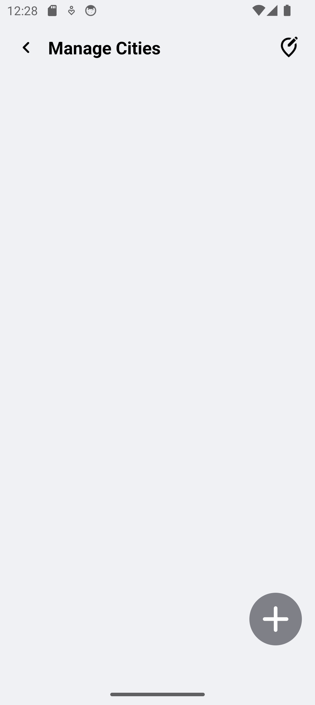
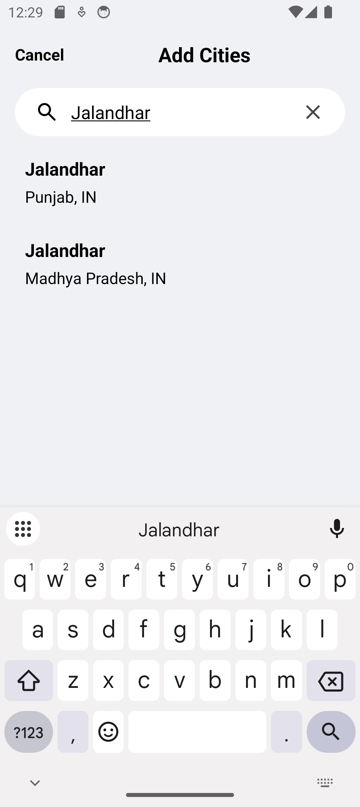
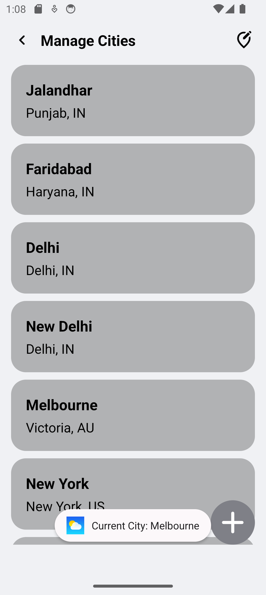
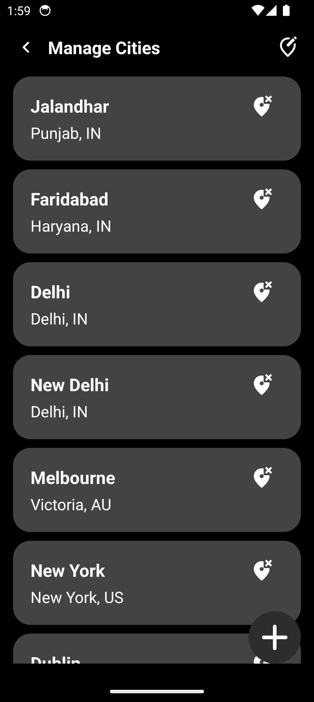

# oMo – Osam Mosam
**oMo (Osam Mosam)** is a user-friendly Android weather application that provides accurate, real-time, and location-based weather information. 
It focuses on simplicity while delivering essential weather insights like temperature, AQI, UV index, and forecasts. 
The app is designed to help users make informed daily decisions without overwhelming them with cluttered data.

---

## Features

- Real-time weather updates based on user-selected or current location  
- Displays current temperature, feels-like temperature, humidity, wind speed, and pressure  etc
- Air Quality Index (AQI) and UV Index (UVI) for health-aware decisions  
- 5-day weather forecast and hourly / 3-hour interval forecasts  
- Multi-city tracking – save, switch, and delete multiple cities  
- Sunrise and sunset timings for better daily planning  
- Light & Dark mode support  
- Responsive design using scrolls 
- Clean, minimal, and intuitive Material Design UI

---

## Tech Stack / Technologies Used

- **Platform:** Android  
- **IDE:** Android Studio  
- **Languages:** Java, XML  

### APIs
- OpenWeatherMap API  
- Open-Meteo API

### Libraries & Tools
- Glide – image loading  
- Gson – JSON parsing  
- Simple HTTP Request – API handling  
- Material Components  

### Database & Storage 
- SharedPreferences  

---

## Future Enhancements

- GPS-based automatic location detection  
- Weather alerts and notifications for extreme conditions  
- Animated backgrounds based on real-time weather  
- Home screen weather widget  
- AI-based lifestyle tips based on weather conditions  
- Google Maps integration for enhanced location features  
- Advanced analytics and long-term climate insights  

---
## Screenshots
        
        
     
     

## Project Status

This project was developed as a **Minor Project** for the **Bachelor of Computer Applications (BCA)** program and is open for future improvements and feature enhancements.