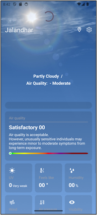
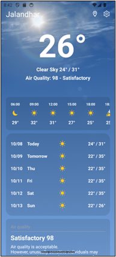
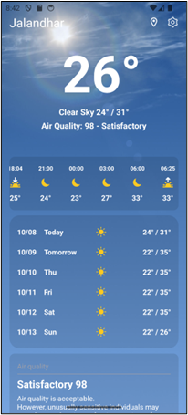
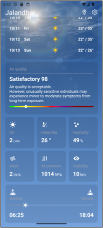
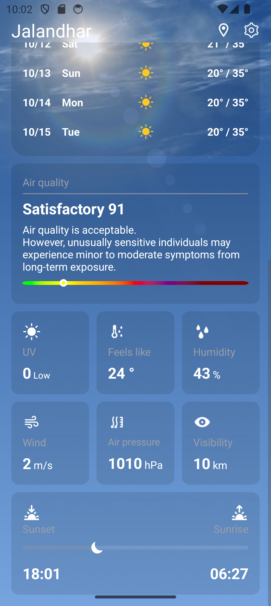
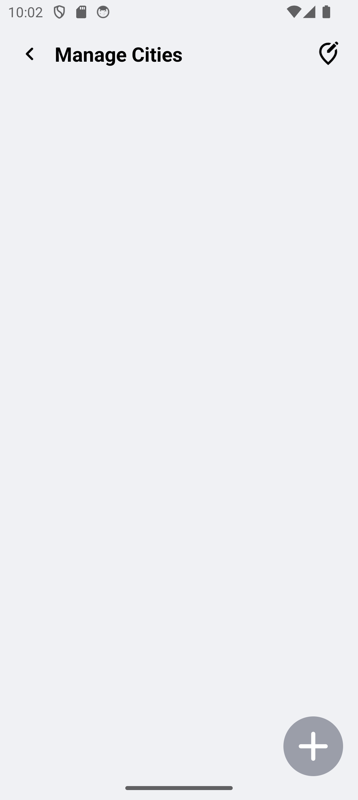
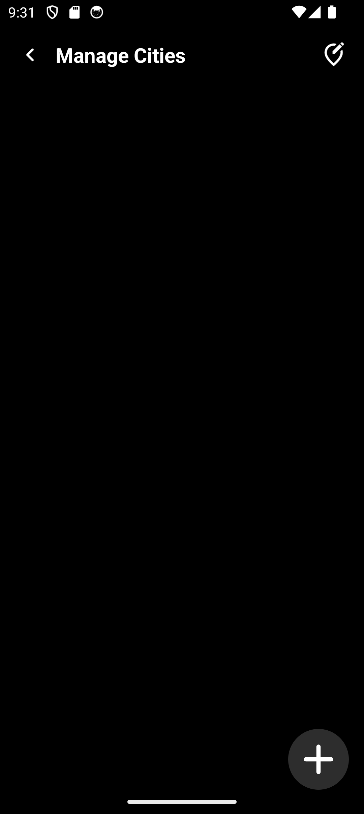
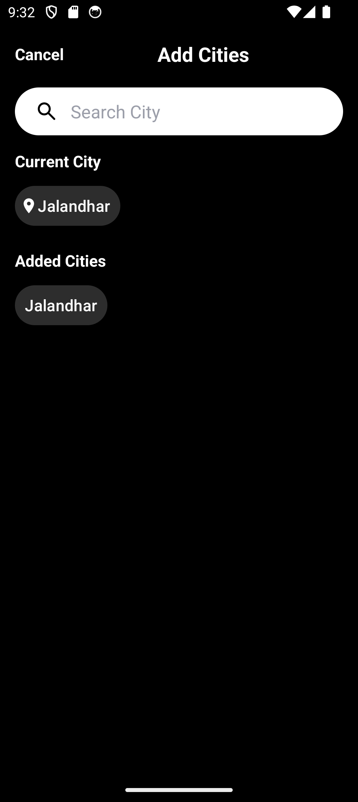
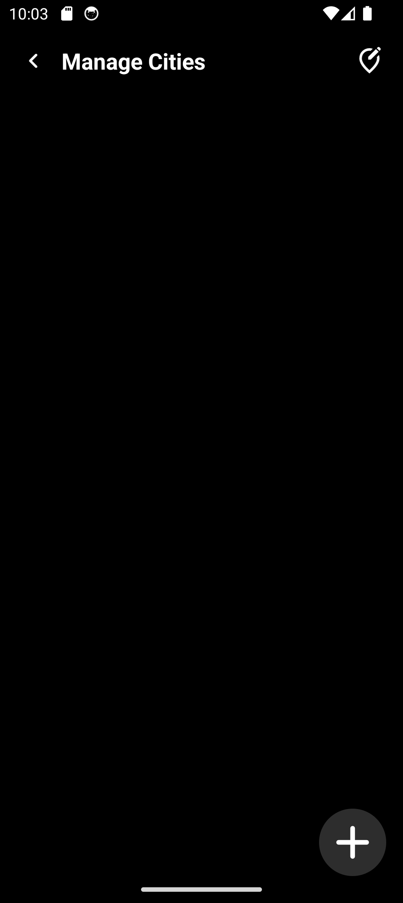
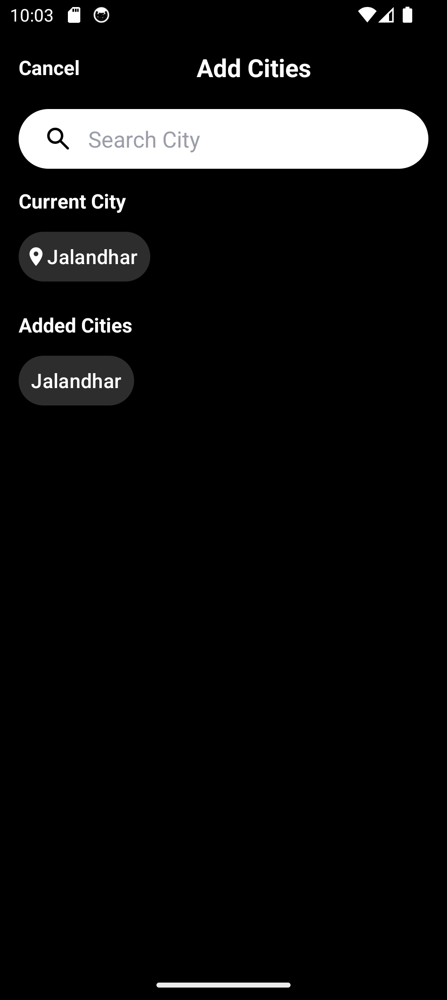

# oMo (Osam Mosam) Weather App

## Description
oMo is a comprehensive weather application that provides users with detailed weather information for any location. Users can either search for a city or use their current location to access real-time weather data, hourly forecasts, and a 5-day weather outlook.

## Features
- **Current Weather Conditions:**
  - Temperature (current, feels like, minimum, and maximum)
  - Weather description (e.g., cloudy, sunny)
  - Air Quality Index (AQI)
  - UV Index (UVI)
  - Humidity level
  - Wind speed and direction
  - Air pressure
  - Visibility distance
  - Sunrise and sunset timings (with dynamic icon switching)
  
- **Hourly Forecasts:**
  - Provides detailed weather forecasts for the next 24 hours at 3-hour intervals.
  
- **5-Day Weather Forecast**:
  - Displays day and date along with maximum and minimum temperatures.
  - Shows weather icons representing the forecast conditions for each day.
  - Provides a clear view of upcoming weather conditions for the next 5 days
  
- **Dynamic City Search:**
  - Allows users to search for and add multiple cities for quick weather updates.
  
- **Responsive Design:**
  - Adjusts to various screen sizes and supports both dark and light themes.

## Technologies Used
- **Android**: Native Android app development.
- **Java**: Core programming language.
- **XML**: For designing app layouts and UI components.
- **OpenWeatherMap API**: For real-time weather data.
- **Open-Meteo API**: For extended weather forecasts (AQI & UVI).
- **SimpleHTTP**: Used for making HTTP requests to fetch weather data from APIs.

## Future Enhancements
- **Dynamic Locations**: Users will be able to receive weather updates based on real-time location tracking.
- **Weather Alerts**: Get notified of severe weather conditions in your selected cities.
- **Widgets**: Add home screen widgets for quick weather updates.
- **Dynamic Backgrounds**: The app will feature dynamically changing backgrounds, potentially with animations, that reflect the current weather conditions.

## Project Status
This project is currently under development. Some features may be incomplete or subject to change as new features are being added. Check back for future updates!

## Screenshots
  
   
   
  

